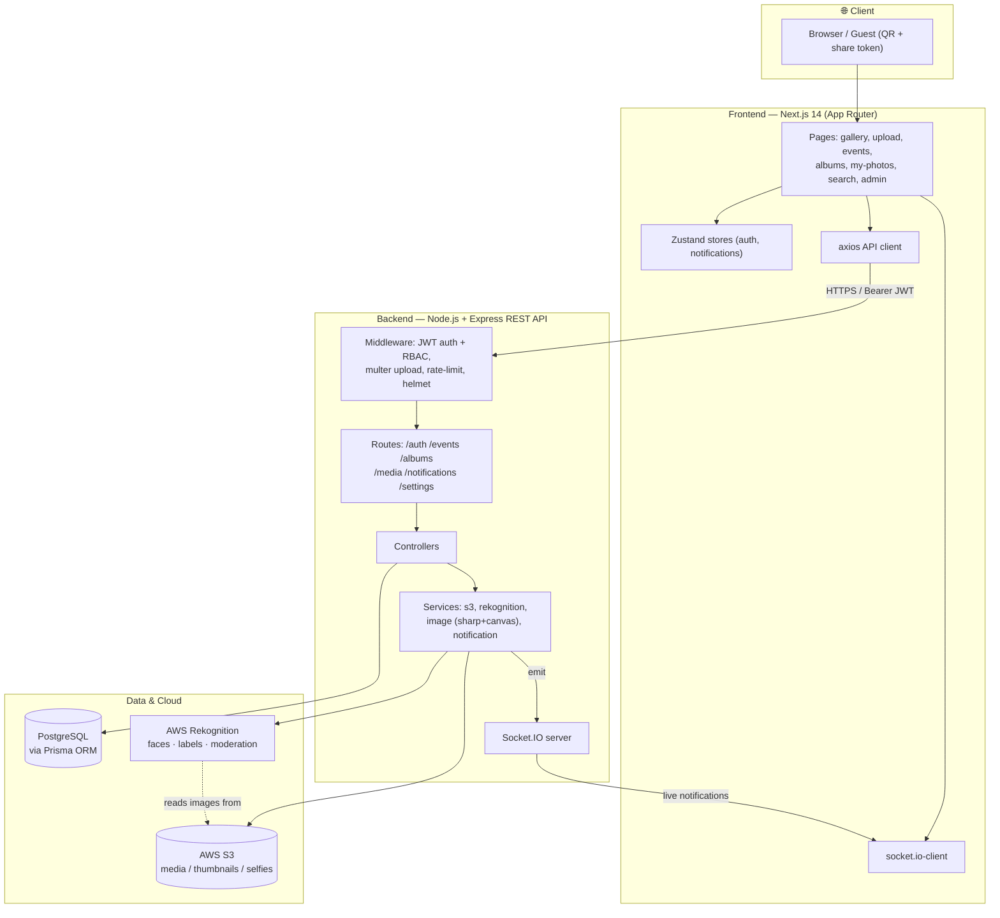
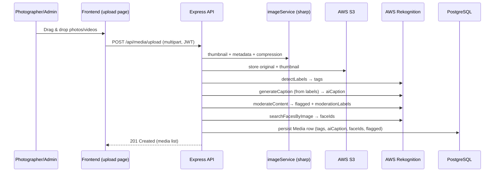
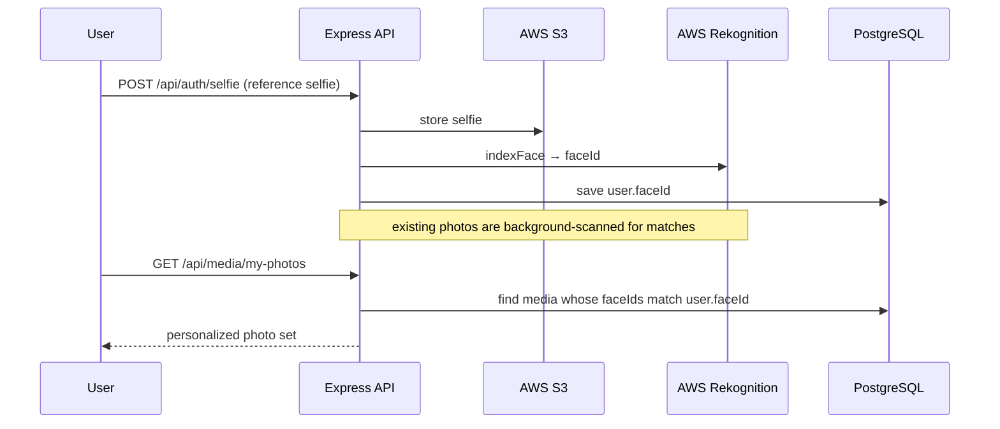
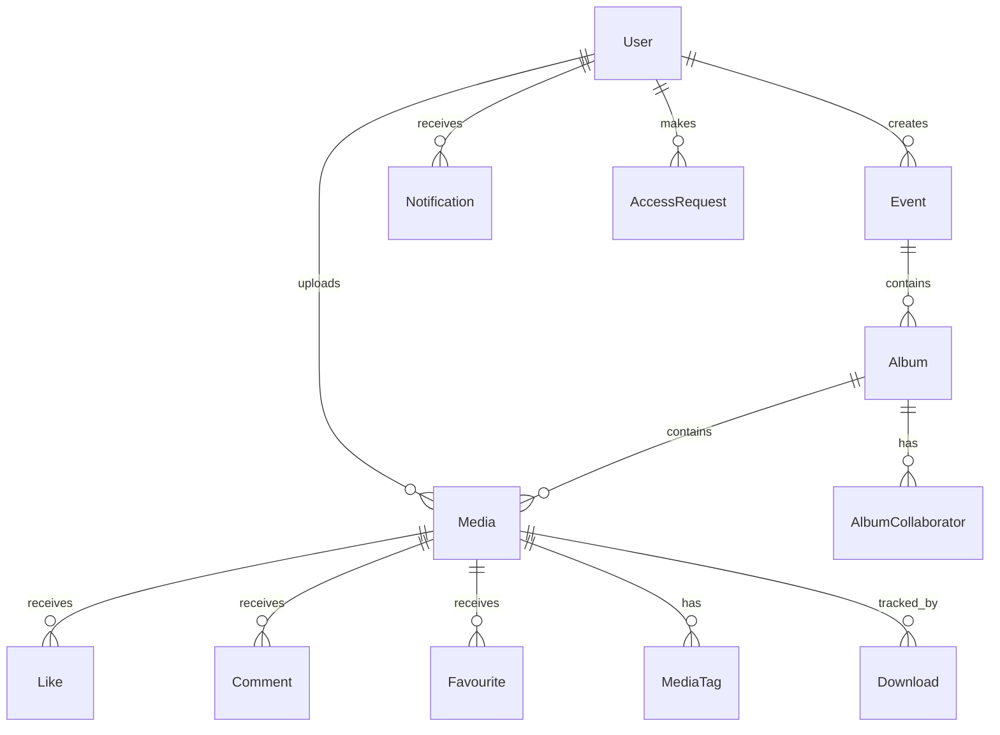

# Architecture

The Event & Media Management Platform is a three-tier web application: a Next.js
frontend, a Node.js/Express REST API, and a PostgreSQL database, with AWS S3 +
Rekognition providing cloud storage and AI, and Socket.IO providing real-time
notifications. All three tiers are containerized with Docker Compose.

## System diagram

## Request flows

### Media upload + AI pipeline

### Face-recognition "My Photos"

## Components

| Tier | Technology | Responsibility |
|------|-----------|----------------|
| Frontend | Next.js 14, React 18, TypeScript, Tailwind, Radix, Zustand | UI, client-side state, realtime client |
| API | Node.js, Express | REST endpoints, auth, orchestration |
| Auth/Access | JWT, bcryptjs, RBAC middleware | 4-role access control (ADMIN/PHOTOGRAPHER/CLUB_MEMBER/VIEWER), public/private gating |
| Media processing | sharp, canvas | thumbnails, compression, dynamic watermarks |
| AI/ML | AWS Rekognition | image labels, AI captions, content moderation, facial recognition |
| Storage | AWS S3 (local-disk fallback) | media, thumbnails, avatars, selfies, covers |
| Realtime | Socket.IO | live notifications (likes, comments, tags, approvals) |
| Database | PostgreSQL + Prisma ORM | persistence and migrations |
| Infra | Docker Compose | Postgres + backend + frontend |

## Data model (high level)

See [`docs/DATABASE_SCHEMA.md`](DATABASE_SCHEMA.md) for the full entity-relationship
diagram and table-by-table reference,
[`backend/prisma/schema.prisma`](../backend/prisma/schema.prisma) for the
authoritative schema, and [`backend/prisma/migrations/`](../backend/prisma/migrations/)
for the migration history.
