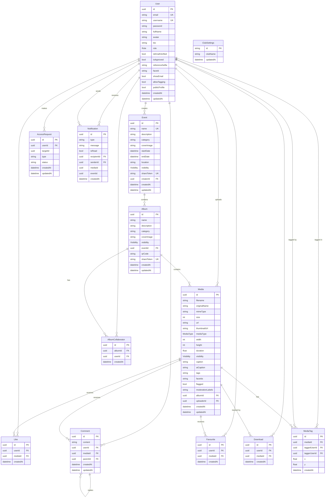

# Database Schema

The Event & Media Management Platform persists all application data in a
**PostgreSQL** database accessed through the **Prisma ORM**. The authoritative
source is [`backend/prisma/schema.prisma`](../backend/prisma/schema.prisma); the
incremental change history lives in
[`backend/prisma/migrations/`](../backend/prisma/migrations/). This document is a
human-readable reference generated from that schema.

- **Engine:** PostgreSQL
- **ORM / migrations:** Prisma
- **Primary keys:** UUID (`@default(uuid())`) on every table unless noted
- **Timestamps:** `createdAt` defaults to insert time; `updatedAt` auto-updates
- **13 tables** (`users`, `events`, `albums`, `album_collaborators`, `media`,
  `likes`, `comments`, `favourites`, `media_tags`, `notifications`, `downloads`,
  `access_requests`, `club_settings`)

## Entity-relationship diagram

## Enumerations

| Enum | Values | Used by |
|------|--------|---------|
| `Role` | `ADMIN`, `PHOTOGRAPHER`, `CLUB_MEMBER`, `VIEWER` | `users.role` |
| `MediaType` | `PHOTO`, `VIDEO` | `media.mediaType` |
| `Visibility` | `PUBLIC`, `PRIVATE` | `events.visibility`, `albums.visibility`, `media.visibility` |

## Tables

### `users`
Application accounts, authentication, profile, and per-user privacy settings.

| Column | Type | Notes |
|--------|------|-------|
| `id` | UUID | PK |
| `email` | String | **Unique** |
| `username` | String | **Unique** |
| `password` | String | bcrypt hash |
| `fullName` | String | |
| `avatar` | String? | Optional profile image URL |
| `bio` | String? | |
| `role` | Role | Default `VIEWER` |
| `isEmailVerified` | Boolean | Default `false` |
| `isApproved` | Boolean | Default `true` (club-member approval gate) |
| `referenceSelfie` | String? | Selfie used for face indexing |
| `faceId` | String? | AWS Rekognition face ID |
| `showEmail` | Boolean | Default `false` |
| `allowTagging` | Boolean | Default `true` |
| `publicProfile` | Boolean | Default `true` |
| `createdAt` / `updatedAt` | DateTime | |

### `events`
Top-level event grouping albums.

| Column | Type | Notes |
|--------|------|-------|
| `id` | UUID | PK |
| `name` | String | **Unique** |
| `description` | String? | |
| `category` | String | |
| `coverImage` | String? | |
| `startDate` | DateTime | |
| `endDate` | DateTime? | |
| `location` | String? | |
| `visibility` | Visibility | Default `PUBLIC` |
| `shareToken` | String? | **Unique** — guest-access token for private events |
| `creatorId` | UUID | FK → `users.id` |
| `createdAt` / `updatedAt` | DateTime | |

### `albums`
A collection of media inside an event.

| Column | Type | Notes |
|--------|------|-------|
| `id` | UUID | PK |
| `name` | String | Unique per event (`@@unique([name, eventId])`) |
| `description` | String? | |
| `category` | String? | |
| `coverImage` | String? | |
| `visibility` | Visibility | Default `PUBLIC` |
| `eventId` | UUID | FK → `events.id`, **cascade delete** |
| `qrCode` | String? | QR for guest access |
| `shareToken` | String? | **Unique** — guest-access token for private albums |
| `createdAt` / `updatedAt` | DateTime | |

### `album_collaborators`
Join table granting users collaborate access to an album.

| Column | Type | Notes |
|--------|------|-------|
| `id` | UUID | PK |
| `albumId` | UUID | FK → `albums.id`, cascade delete |
| `userId` | UUID | FK → `users.id`, cascade delete |
| `createdAt` | DateTime | |
| — | — | `@@unique([albumId, userId])` |

### `media`
The central asset table — one row per photo or video, including AI and moderation metadata.

| Column | Type | Notes |
|--------|------|-------|
| `id` | UUID | PK |
| `filename` | String | Stored file name |
| `originalName` | String | Uploaded file name |
| `mimeType` | String | |
| `size` | Int | Bytes |
| `url` | String | Full-size URL |
| `thumbnailUrl` | String? | |
| `mediaType` | MediaType | `PHOTO` / `VIDEO` |
| `width` / `height` | Int? | Pixels |
| `duration` | Float? | Video length (seconds) |
| `visibility` | Visibility | Default `PUBLIC` |
| `caption` | String? | User caption |
| `aiCaption` | String? | AI-generated caption |
| `tags` | String[] | AI/user tags |
| `faceIds` | String[] | Rekognition face IDs detected |
| `flagged` | Boolean | Default `false` — moderation flag |
| `moderationLabels` | String[] | Rekognition moderation labels |
| `albumId` | UUID | FK → `albums.id`, **cascade delete** |
| `uploaderId` | UUID | FK → `users.id` |
| `createdAt` / `updatedAt` | DateTime | |

### `likes`
| Column | Type | Notes |
|--------|------|-------|
| `id` | UUID | PK |
| `userId` | UUID | FK → `users.id`, cascade delete |
| `mediaId` | UUID | FK → `media.id`, cascade delete |
| `createdAt` | DateTime | |
| — | — | `@@unique([userId, mediaId])` — one like per user per media |

### `comments`
Threaded comments with self-referential replies.

| Column | Type | Notes |
|--------|------|-------|
| `id` | UUID | PK |
| `content` | String | |
| `userId` | UUID | FK → `users.id`, cascade delete |
| `mediaId` | UUID | FK → `media.id`, cascade delete |
| `parentId` | UUID? | FK → `comments.id` (reply thread) |
| `createdAt` / `updatedAt` | DateTime | |

### `favourites`
| Column | Type | Notes |
|--------|------|-------|
| `id` | UUID | PK |
| `userId` | UUID | FK → `users.id`, cascade delete |
| `mediaId` | UUID | FK → `media.id`, cascade delete |
| `createdAt` | DateTime | |
| — | — | `@@unique([userId, mediaId])` |

### `media_tags`
Person tags placed on a photo, with optional positional coordinates.

| Column | Type | Notes |
|--------|------|-------|
| `id` | UUID | PK |
| `mediaId` | UUID | FK → `media.id`, cascade delete |
| `taggedUserId` | UUID | FK → `users.id` (the tagged person), cascade delete |
| `taggerUserId` | UUID | FK → `users.id` (who tagged), cascade delete |
| `x` | Float? | Tag X position, % of width (0–100); null for legacy tags |
| `y` | Float? | Tag Y position, % of height (0–100) |
| `createdAt` | DateTime | |
| — | — | `@@unique([mediaId, taggedUserId])` |

### `notifications`
In-app / realtime notifications.

| Column | Type | Notes |
|--------|------|-------|
| `id` | UUID | PK |
| `type` | String | e.g. like, comment, tag, approval |
| `message` | String | |
| `isRead` | Boolean | Default `false` |
| `recipientId` | UUID | FK → `users.id`, cascade delete |
| `senderId` | UUID? | FK → `users.id`, **set null** on delete |
| `mediaId` | UUID? | Optional reference |
| `eventId` | UUID? | Optional reference |
| `createdAt` | DateTime | |

### `downloads`
Download audit trail.

| Column | Type | Notes |
|--------|------|-------|
| `id` | UUID | PK |
| `userId` | UUID | FK → `users.id`, cascade delete |
| `mediaId` | UUID | FK → `media.id`, cascade delete |
| `createdAt` | DateTime | |

### `access_requests`
Requests to access a private event or album.

| Column | Type | Notes |
|--------|------|-------|
| `id` | UUID | PK |
| `userId` | UUID | FK → `users.id`, cascade delete |
| `targetId` | UUID | Event or album ID (polymorphic) |
| `type` | String | `'EVENT'` or `'ALBUM'` |
| `status` | String | `PENDING` (default), `APPROVED`, `REJECTED` |
| `createdAt` / `updatedAt` | DateTime | |
| — | — | `@@unique([userId, targetId, type])` |

### `club_settings`
Single-row (singleton) table for global club configuration.

| Column | Type | Notes |
|--------|------|-------|
| `id` | String | PK, fixed value `"singleton"` |
| `clubName` | String | |
| `updatedAt` | DateTime | |

## Relationships & integrity

| Parent | Child | On parent delete |
|--------|-------|------------------|
| `events` | `albums` | **Cascade** |
| `albums` | `media`, `album_collaborators` | **Cascade** |
| `media` | `likes`, `comments`, `favourites`, `media_tags`, `downloads` | **Cascade** |
| `users` | `likes`, `comments`, `favourites`, `downloads`, `album_collaborators`, `media_tags`, `access_requests`, received `notifications` | **Cascade** |
| `users` | sent `notifications` (`senderId`) | **Set null** |
| `users` | `events` (`creatorId`), `media` (`uploaderId`) | Restrict (default) |

Deleting an event therefore cascades down through its albums and all media and
engagement records; deleting a user removes their engagement while preserving
notifications they sent (sender set to null).

## Uniqueness constraints (summary)

- `users.email`, `users.username`
- `events.name`, `events.shareToken`
- `albums.shareToken`, `albums (name, eventId)`
- `album_collaborators (albumId, userId)`
- `likes (userId, mediaId)`
- `favourites (userId, mediaId)`
- `media_tags (mediaId, taggedUserId)`
- `access_requests (userId, targetId, type)`

## Migration history

The schema evolved through the migrations in
[`backend/prisma/migrations/`](../backend/prisma/migrations/):

| Migration | Change |
|-----------|--------|
| `add_moderation_highlights_duplicates` | AI moderation fields |
| `add_access_requests` | `access_requests` table |
| `add_club_settings` | `club_settings` singleton |
| `add_share_token` | Album guest-access tokens |
| `add_user_privacy_settings` | `showEmail`, `allowTagging`, `publicProfile` |
| `add_event_share_token` | Event guest-access tokens |
| `add_club_member_approval` | `isApproved` gate |
| `add_tag_position` | `media_tags.x` / `.y` coordinates |
| `add_album_category` | `albums.category` |
| `add_media_flagged` | `media.flagged` moderation flag |
